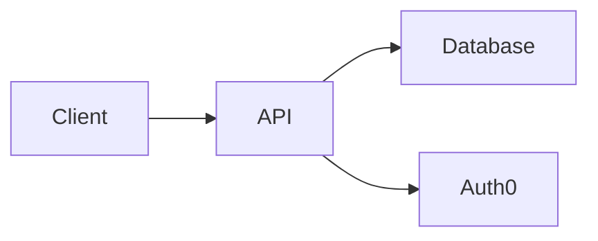

# Design Document

## Overview
Kanda Technologies will develop a web application to modernize the insurance experience.  The application will connect customers, agents, and insurance providers through a centralized platform.  The technology stack includes React for the frontend, Node.js with Express.js for the backend API, PostgreSQL for the database, Material UI for the UI framework, Auth0 for authentication, and Netlify for hosting.

## Architecture

### System Components


### Data Flow
1. The client sends requests to the backend API.
2. The API interacts with the database and Auth0 for authentication and data retrieval.
3. The API returns data to the client.

## Components and Interfaces

### User Authentication
**Key Components:**
```typescript
interface User {
  id: string;
  role: 'customer' | 'agent' | 'provider';
  email: string;
}
```

### Policy Management
**Key Components:**
```typescript
interface Policy {
  id: string;
  customerId: string;
  type: string;
  startDate: Date;
  endDate: Date;
}
```

## Data Models

```typescript
interface Claim {
  id: string;
  policyId: string;
  dateFiled: Date;
  status: 'pending' | 'approved' | 'denied';
}
```

```json
{
  "id": "123",
  "policyId": "456",
  "dateFiled": "2024-10-27T12:00:00Z",
  "status": "pending"
}
```

## Error Handling

- **Authentication Errors:** Invalid credentials, unauthorized access.
- **Data Validation Errors:** Missing required fields, invalid data formats.
- **Database Errors:** Connection errors, query errors.

## Testing Strategy

### Unit Testing
Individual components and functions will be tested using Jest and React Testing Library.

### Integration Testing
Interactions between different components and services will be tested.

### End-to-End Testing
User flows and scenarios will be tested using Cypress or similar tools.

### Manual Testing
Exploratory testing and usability testing will be conducted.
