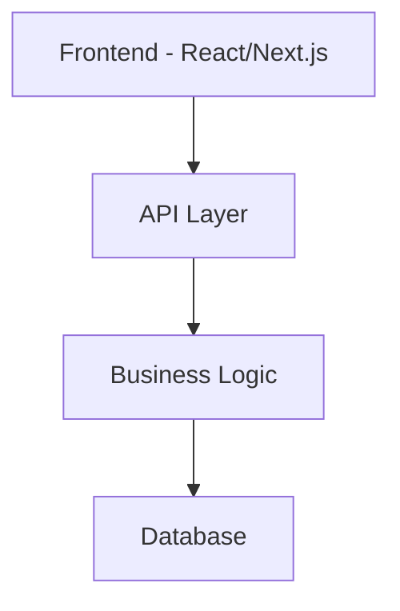

# Design Document

## Overview

TXX is built using modern web technologies with a focus on performance, scalability, and user experience.

## Architecture

### System Components



## Components and Interfaces

### Frontend Components
- User Interface components
- State management
- API integration

### Backend Services
- API endpoints
- Authentication
- Data validation

## Data Models

### User Model
```typescript
interface User {
  id: string;
  email: string;
  name: string;
  createdAt: Date;
}
```

## Error Handling

- Client-side error boundaries
- API error responses
- Logging and monitoring

## Testing Strategy

- Unit tests for components
- Integration tests for API
- End-to-end testing
