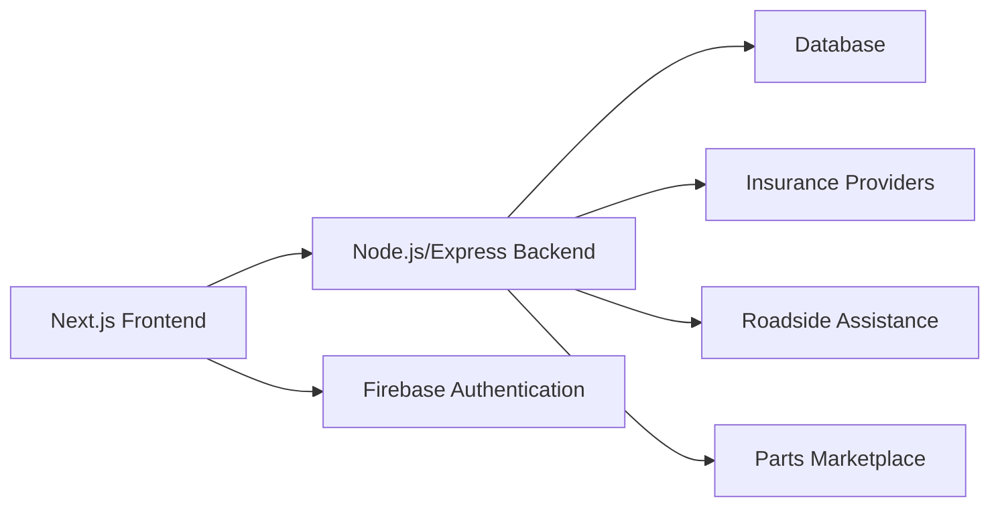

# Design Document

## Overview
Kanda Assist is a comprehensive Flutter mobile application that streamlines the vehicle ownership experience. It provides access to insurance quotes, roadside assistance, claims management, and an automotive marketplace.  This document outlines the technical design of the application, utilizing Next.js for the frontend, Node.js with Express for the backend, Shadcn-UI for the UI, Firebase Authentication for user authentication, and Netlify for hosting.

## Architecture

### System Components


### Data Flow
1. User interacts with the Next.js frontend.
2. Frontend communicates with the Node.js/Express backend API.
3. Backend interacts with the database, insurance providers, roadside assistance services, and the parts marketplace.
4. Data is returned to the frontend for display.

## Components and Interfaces

### Authentication Component
**Key Components:**
```typescript
interface User {
  uid: string;
  email: string;
  displayName?: string;
}
```

### Insurance Quote Component
**Key Components:**
```typescript
interface Quote {
  provider: string;
  price: number;
  coverage: string;
}
```

## Data Models

```typescript
interface Vehicle {
  make: string;
  model: string;
  year: number;
}

// JSON Example
{
  "make": "Toyota",
  "model": "Camry",
  "year": 2023
}
```

## Error Handling

- **Authentication Errors:** Invalid credentials, account not found.
- **Network Errors:** API connection issues.
- **Data Errors:** Invalid data format, missing data.

## Testing Strategy

### Unit Testing
Individual components and functions will be tested using Jest and React Testing Library.

### Integration Testing
Interactions between components and API endpoints will be tested.

### End-to-End Testing
User flows will be tested using Cypress or similar tools.

### Manual Testing
Exploratory testing will be performed to identify usability issues.
