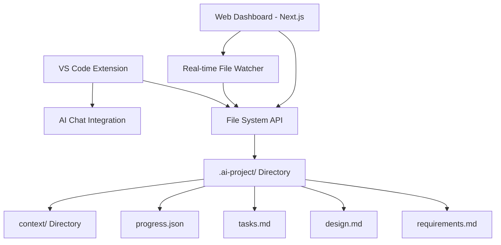

# Design Document

## Overview

The AI Project Manager consists of two main components: a Next.js web dashboard for project management and a VS Code extension for AI context injection. The system uses a file-based architecture where all project data is stored in markdown files within a `.ai-project/` directory structure, enabling seamless synchronization between the web interface and VS Code extension through file system operations.

## Architecture

### System Components



### Data Flow

1. **Web Dashboard → File System**: User edits markdown files through Monaco editor, changes auto-save to local files
2. **File System → VS Code Extension**: Extension watches for file changes, updates context injection
3. **VS Code Extension → File System**: Progress tracking updates tasks.md and progress.json based on code changes
4. **File System → Web Dashboard**: File watcher detects changes and updates UI in real-time

## Components and Interfaces

### Web Dashboard (Next.js Application)

**Core Pages:**
- `/` - Project overview and selection
- `/project/[id]` - Individual project dashboard
- `/project/[id]/requirements` - Requirements editor
- `/project/[id]/design` - Design document editor
- `/project/[id]/tasks` - Task management interface
- `/project/[id]/context` - Context document management
- `/project/[id]/progress` - Progress visualization

**Key Components:**
```typescript
interface ProjectDashboard {
  projectId: string;
  projectPath: string;
  documents: ProjectDocuments;
  progress: ProgressData;
  contextDocs: ContextDocument[];
}

interface ProjectDocuments {
  requirements: string;
  design: string;
  tasks: string;
}

interface ProgressData {
  totalTasks: number;
  completedTasks: number;
  percentage: number;
  lastUpdated: Date;
  recentActivity: ActivityItem[];
}
```

**File System Integration:**
- Uses Node.js `fs` API to read/write markdown files
- Implements file watching with `chokidar` for real-time updates
- Provides REST API endpoints for CRUD operations on project files

### VS Code Extension

**Core Functionality:**
```typescript
interface VSCodeExtension {
  projectDetector: ProjectDetector;
  contextInjector: ContextInjector;
  progressTracker: ProgressTracker;
  fileWatcher: FileWatcher;
}

interface ProjectDetector {
  detectAiProject(): boolean;
  getProjectStructure(): ProjectStructure;
  validateProjectFiles(): ValidationResult;
}

interface ContextInjector {
  getCurrentContext(): ProjectContext;
  formatContextForAI(): string;
  selectRelevantDocs(currentFile: string): ContextDocument[];
}
```

**AI Integration Points:**
- Command palette integration for manual context injection
- Automatic context injection when AI chat is opened
- Smart context selection based on currently edited files
- Formatted output optimized for AI model consumption

### File System Structure

```
project-root/
├── .ai-project/
│   ├── config.json          # Project metadata
│   ├── requirements.md      # Project requirements
│   ├── design.md           # System design
│   ├── tasks.md            # Task list with checkboxes
│   ├── progress.json       # Progress tracking data
│   └── context/            # User context documents
│       ├── api-spec.md
│       ├── user-research.md
│       └── design-system.md
└── src/                    # Project source code
```

## Data Models

### Project Configuration
```json
{
  "projectId": "uuid-v4",
  "name": "My Web App",
  "description": "A modern web application",
  "template": "web-app",
  "createdAt": "2024-01-01T00:00:00Z",
  "lastModified": "2024-01-02T00:00:00Z",
  "aiModel": "gpt-4",
  "contextPreferences": {
    "maxContextSize": 8000,
    "prioritizeRecent": true,
    "includeProgress": true
  }
}
```

### Progress Tracking
```json
{
  "totalTasks": 15,
  "completedTasks": 8,
  "percentage": 53,
  "lastUpdated": "2024-01-02T10:30:00Z",
  "taskHistory": [
    {
      "taskId": "task-1",
      "title": "Set up project structure",
      "completedAt": "2024-01-01T14:00:00Z",
      "completedBy": "auto-detection"
    }
  ],
  "milestones": [
    {
      "name": "MVP Complete",
      "targetDate": "2024-02-01",
      "progress": 60
    }
  ]
}
```

### Context Document
```typescript
interface ContextDocument {
  id: string;
  filename: string;
  title: string;
  content: string;
  tags: string[];
  category: 'api' | 'design' | 'research' | 'requirements' | 'other';
  lastModified: Date;
  relevanceScore?: number; // Calculated by VS Code extension
}
```

## Error Handling

### File System Errors
- **File Not Found**: Graceful degradation with template generation
- **Permission Errors**: Clear error messages with resolution steps
- **Concurrent Modifications**: Conflict resolution with merge options
- **Disk Space**: Warnings and cleanup suggestions

### Synchronization Errors
- **Network Issues**: Offline mode with sync queue
- **Version Conflicts**: Three-way merge with user intervention
- **Data Corruption**: Backup restoration and validation

### VS Code Extension Errors
- **Project Detection Failures**: Fallback to manual project selection
- **Context Injection Failures**: Graceful degradation with basic context
- **AI Integration Issues**: Clear error messages and retry mechanisms

## Testing Strategy

### Unit Testing
- **Web Dashboard**: Jest + React Testing Library for component testing
- **VS Code Extension**: VS Code Extension Test Runner for extension APIs
- **File Operations**: Mock file system for reliable testing
- **Context Injection**: Test context formatting and selection logic

### Integration Testing
- **File Synchronization**: Test real-time sync between dashboard and extension
- **Progress Tracking**: Verify automatic task completion detection
- **Template Generation**: Test project initialization with various templates
- **Error Scenarios**: Test conflict resolution and error recovery

### End-to-End Testing
- **User Workflows**: Playwright tests for complete user journeys
- **Cross-Platform**: Test on Windows, macOS, and Linux
- **Performance**: Load testing with large projects and many context documents
- **AI Integration**: Mock AI responses to test context injection effectiveness

### Manual Testing
- **Usability**: User experience testing with real developers
- **Performance**: Real-world performance with actual projects
- **Edge Cases**: Unusual project structures and file configurations
- **Accessibility**: Screen reader and keyboard navigation testing